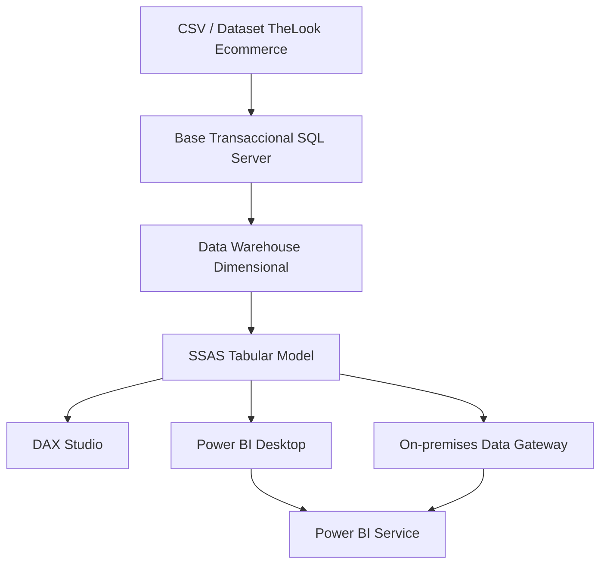

# 🚀 BI_CUBO_OLAP_TABULAR

<p align="center">
  
  
  
  
  
</p>

<p align="center">
  <b>Modelo BI completo para TheLook Ecommerce</b><br>
  SQL Server DWH · SSAS Tabular · DAX avanzado · KPIs · DAX Studio · Power BI Service
</p>

---

## 📌 Resumen ejecutivo

Este repositorio contiene una solución de **Inteligencia de Negocios** construida sobre el dataset **TheLook Ecommerce**. El proyecto integra una base transaccional normalizada, un **Data Warehouse dimensional tipo constelación**, un modelo **SSAS Tabular**, medidas **DAX avanzadas**, KPIs de negocio, análisis de rendimiento con **DAX Studio** y publicación en **Power BI Service** mediante **On-premises Data Gateway**.

El propósito principal es comparar el rendimiento entre:

- Consultas analíticas directas al **DWH en SQL Server**.
- Consultas equivalentes ejecutadas sobre el **modelo SSAS Tabular** con DAX.

---

## 🧱 Arquitectura del proyecto



```text
CSV / Dataset TheLook Ecommerce
        ↓
Base Transaccional SQL Server
        ↓
Data Warehouse Dimensional
        ↓
SSAS Tabular Model
        ↓
DAX Studio / Power BI Desktop
        ↓
Power BI Service
```

---

## 🗃️ Bases de datos utilizadas

| Componente | Nombre |
|---|---|
| Base transaccional | `db_transc_thelook` |
| Data Warehouse | `db_dwh_thelook` |
| Modelo Tabular | `fact_sales_cubo` |
| Servidor SSAS Tabular | `NIK-RAMIREZ-BAU\TABULAR` |
| Gateway | `Gateway_NIK_RAMIREZ` |

---

## 🧩 Modelo dimensional

El DWH fue diseñado como una **constelación de hechos**, con varias tablas fact que comparten dimensiones.

### ⭐ Tablas de hechos

```text
fact_sales
fact_orders
fact_inventory
fact_events
```

### 📐 Dimensiones

```text
dim_date
dim_product
dim_user
dim_traffic_source
dim_order_status
dim_order_item_status
dim_browser
dim_event_type
dim_event_location
dim_session
```

---

## 🧠 Modelo SSAS Tabular

El modelo tabular principal se desplegó en una instancia local de **SQL Server Analysis Services Tabular**.

```text
Servidor: NIK-RAMIREZ-BAU\TABULAR
Base tabular: fact_sales_cubo
```

Tablas principales cargadas en el modelo tabular de ventas:

```text
fact_sales
dim_date
dim_product
dim_user
dim_order_status
dim_order_item_status
```

---

## 📊 Medidas DAX principales

### Ventas

```DAX
Total Sales :=
SUM(fact_sales[sale_price])
```

```DAX
Total Gross Margin :=
SUM(fact_sales[gross_margin])
```

```DAX
Total Quantity :=
SUM(fact_sales[quantity])
```

```DAX
Total Orders :=
DISTINCTCOUNT(fact_sales[order_id])
```

```DAX
Margin % :=
DIVIDE(
    [Total Gross Margin],
    [Total Sales],
    0
)
```

---

## ⏱️ DAX de inteligencia de tiempo

```DAX
Total Sales LY :=
CALCULATE(
    [Total Sales],
    SAMEPERIODLASTYEAR(dim_date[full_date])
)
```

```DAX
Sales YOY Growth % :=
DIVIDE(
    [Total Sales] - [Total Sales LY],
    [Total Sales LY],
    0
)
```

```DAX
Total Sales YTD :=
TOTALYTD(
    [Total Sales],
    dim_date[full_date]
)
```

```DAX
Total Sales Rolling 3 Months :=
CALCULATE(
    [Total Sales],
    DATESINPERIOD(
        dim_date[full_date],
        MAX(dim_date[full_date]),
        -3,
        MONTH
    )
)
```

---

---

## 🚦 Resumen de KPIs implementados en SSAS Tabular

Esta sección documenta los KPIs principales implementados en el modelo **SSAS Tabular** del proyecto BI. Los KPIs permiten evaluar visualmente el desempeño de ventas, crecimiento y rentabilidad mediante medidas DAX, objetivos empresariales y estados tipo semáforo.

---

### 1. KPI: `Sales YOY Growth %`

| Elemento | Descripción |
|---|---|
| **Nombre del KPI** | `Sales YOY Growth %` |
| **Tabla** | `fact_sales` |
| **Medida base** | `Sales YOY Growth %` |
| **Formato** | Porcentaje `%`, con 2 decimales |
| **Tipo de objetivo** | Absolute Value |
| **Valor objetivo** | `150%` o `1.50` |
| **Resultado obtenido** | `175.90%` |
| **Indicador visual** | Shapes / Semáforo estándar |

#### Objetivo empresarial

Medir el crecimiento porcentual de ventas respecto al año anterior. Este KPI permite evaluar si las ventas están creciendo o disminuyendo en comparación con el periodo anterior.

#### Fórmula DAX

```DAX
Sales YOY Growth % :=
DIVIDE(
    [Total Sales] - [Total Sales LY],
    [Total Sales LY],
    0
)
```

#### Configuración del KPI

```text
Valor base: Sales YOY Growth %
Objetivo esperado: 150% / 1.50
Tipo de objetivo: Absolute Value
Formato: Porcentaje (%)
Decimales: 2
```

#### Rangos del indicador visual

| Estado | Condición | Interpretación |
|---|---:|---|
| 🟢 Verde | `>= 150%` | Crecimiento anual sobresaliente |
| 🟡 Amarillo | `50% a 149%` | Crecimiento moderado |
| 🔴 Rojo | `< 50%` | Crecimiento bajo o disminución |

#### Interpretación del resultado

El resultado obtenido fue aproximadamente **175.90%**, lo que indica que las ventas crecieron de forma significativa respecto al año anterior. Este resultado supera el objetivo esperado de **150%**, por lo que el KPI se interpreta como un desempeño comercial elevado.

---

### 2. KPI: `Margin %`

| Elemento | Descripción |
|---|---|
| **Nombre del KPI** | `Margin %` |
| **Tabla** | `fact_sales` |
| **Medida base** | `Margin %` |
| **Formato** | Porcentaje `%`, con 2 decimales |
| **Tipo de objetivo** | Absolute Value |
| **Valor objetivo** | `50%` o `0.50` |
| **Resultado obtenido** | `51.88%` |
| **Indicador visual** | Shapes / Semáforo estándar |

#### Objetivo empresarial

Medir el porcentaje de rentabilidad obtenido sobre las ventas. Este KPI permite identificar qué proporción de las ventas representa margen o ganancia sobre el total vendido.

#### Fórmula DAX

```DAX
Margin % :=
DIVIDE(
    [Total Gross Margin],
    [Total Sales],
    0
)
```

#### Configuración del KPI

```text
Valor base: Margin %
Objetivo esperado: 50% / 0.50
Tipo de objetivo: Absolute Value
Formato: Porcentaje (%)
Decimales: 2
```

#### Rangos del indicador visual

| Estado | Condición | Interpretación |
|---|---:|---|
| 🟢 Verde | `>= 50%` | Rentabilidad positiva y dentro del objetivo |
| 🟡 Amarillo | `40% a 49%` | Rentabilidad aceptable, pero debajo del objetivo |
| 🔴 Rojo | `< 40%` | Rentabilidad baja |

#### Interpretación del resultado

El resultado obtenido fue aproximadamente **51.88%**, lo que indica que la empresa obtiene un margen positivo sobre sus ventas totales. Al superar el objetivo esperado de **50%**, el KPI se interpreta como un resultado favorable de rentabilidad.

---

## ⚙️ Configuración general de KPIs en SSAS Tabular

| Elemento | Configuración |
|---|---|
| **Herramienta** | SQL Server Analysis Services Tabular |
| **Motor** | VertiPaq In-Memory Engine |
| **Lenguaje de cálculo** | DAX, Data Analysis Expressions |
| **Tabla principal** | `fact_sales` |
| **Visualización** | Power BI Desktop / Power BI Service |
| **Tipo de indicador** | Shapes / Semáforo estándar |

### Propósito de los KPIs

- Monitorear el desempeño empresarial.
- Evaluar crecimiento comercial anual.
- Analizar rentabilidad sobre ventas.
- Identificar desviaciones frente a objetivos definidos.
- Apoyar la toma de decisiones estratégicas.
- Integrar indicadores visuales dentro de Power BI.

### Beneficios de los KPIs en el modelo OLAP

- Permiten monitorear rápidamente el estado de los indicadores clave.
- Facilitan el análisis visual en reportes y dashboards de Power BI.
- Se integran directamente en el modelo SSAS Tabular.
- Utilizan procesamiento analítico en memoria mediante VertiPaq.
- Mejoran la toma de decisiones mediante objetivos cuantificables.
- Permiten análisis históricos y comparativos mediante DAX.
- Ayudan a evaluar ventas, margen y crecimiento con semáforos visuales.

---

## 🧮 Medidas auxiliares recomendadas para KPIs

Además de las medidas base, se pueden crear medidas auxiliares para objetivos y estados. Estas medidas facilitan la validación de los KPIs desde DAX Studio, SSMS o Power BI.

### Meta de crecimiento anual

```DAX
Sales YOY Growth Target :=
1.50
```

### Estado de crecimiento anual

```DAX
Sales YOY Growth Status :=
SWITCH(
    TRUE(),
    [Sales YOY Growth %] >= 1.50, 1,
    [Sales YOY Growth %] >= 0.50, 0,
    -1
)
```

### Meta de margen

```DAX
Margin Target :=
0.50
```

### Estado de margen

```DAX
Margin Status :=
SWITCH(
    TRUE(),
    [Margin %] >= 0.50, 1,
    [Margin %] >= 0.40, 0,
    -1
)
```

Interpretación de estados:

```text
 1 = Verde
 0 = Amarillo
-1 = Rojo
```

---

## 🔎 Consulta DAX para validar KPIs

La siguiente consulta permite validar los valores, objetivos y estados de los KPIs desde **DAX Studio** o una consulta DAX en SSMS.

```DAX
EVALUATE
ROW(
    "Sales YOY Growth %", [Sales YOY Growth %],
    "Sales YOY Growth Target", [Sales YOY Growth Target],
    "Sales YOY Growth Status", [Sales YOY Growth Status],

    "Margin %", [Margin %],
    "Margin Target", [Margin Target],
    "Margin Status", [Margin Status]
)
```

También puede consultarse por año:

```DAX
EVALUATE
SUMMARIZECOLUMNS(
    dim_date[year_number],

    "Sales YOY Growth %", [Sales YOY Growth %],
    "Sales YOY Growth Target", [Sales YOY Growth Target],
    "Sales YOY Growth Status", [Sales YOY Growth Status],

    "Margin %", [Margin %],
    "Margin Target", [Margin Target],
    "Margin Status", [Margin Status]
)
ORDER BY
    dim_date[year_number]
```

## 🧪 Metodología de evaluación de rendimiento

Para la comparación de rendimiento se ejecutaron **12 consultas equivalentes** en dos plataformas:

### SQL Server DWH

Se usaron consultas T-SQL sobre `db_dwh_thelook` con:

```sql
SET STATISTICS TIME ON;
SET STATISTICS IO ON;
```

Métricas capturadas:

| Métrica | Descripción |
|---|---|
| CPU time | Tiempo de procesador consumido |
| Elapsed time | Tiempo total transcurrido |
| Logical reads | Páginas leídas desde memoria |

### SSAS Tabular / DAX Studio

Se ejecutaron consultas DAX sobre `fact_sales_cubo`, con:

```text
Server Timings = ON
Query Plan = ON
```

Métricas capturadas:

| Métrica | Descripción |
|---|---|
| Total | Tiempo total de consulta DAX |
| FE | Formula Engine |
| SE | Storage Engine |
| SE Queries | Consultas internas al motor de almacenamiento |
| SE Cache | Porcentaje resuelto desde caché VertiPaq |

---

## 📈 Resumen de rendimiento SQL Server DWH

| # | Prueba | Elapsed (ms) | CPU (ms) | Logical Reads |
|---:|---|---:|---:|---:|
| 1 | Ventas por Departamento en 2021 | 10,147 | 187 | 3,040 |
| 2 | Ventas por Categoría en 2021 | 242 | 219 | 3,040 |
| 3 | Ventas por Mes en 2021 | 47 | 47 | 2,258 |
| 4 | Ventas por País de Usuario en 2021 | 54 | 186 | 4,762 |
| 5 | Ventas por Género y Departamento en 2021 | 253 | 250 | 5,298 |
| 6 | Ventas por Estado de Orden en 2021 | 2,366 | 188 | 2,260 |
| 7 | Ventas por Estado de Ítem en 2021 | 260 | 265 | 2,260 |
| 8 | Top 10 Marcas por Ventas en 2021 | 219 | 219 | 3,040 |
| 9 | Ventas por Centro de Distribución en 2021 | 259 | 235 | 3,040 |
| 10 | Ventas Acumuladas YTD por Mes en 2021 | 33 | 31 | 2,258 |
| 11 | Ventas por Fuente de Tráfico del Usuario en 2021 | 53 | 76 | 4,762 |
| 12 | Ventas por Fin de Semana vs Día Laboral en 2021 | 35 | 31 | 2,258 |

> Las consultas 1 y 6 presentaron tiempos elevados por condiciones de caché frío o posible contención de I/O.

---

## ⚡ Resumen de rendimiento DAX Studio / SSAS Tabular

| # | Prueba | Total (ms) | FE (ms) | SE (ms) | SE Queries | SE Cache |
|---:|---|---:|---:|---:|---:|---:|
| 1 | Ventas por Departamento en 2021 | 4 | 3 | 1 | 2 | 100% |
| 2 | Ventas por Categoría en 2021 | 7 | 4 | 3 | 2 | 100% |
| 3 | Ventas por Mes en 2021 | 7 | 7 | 0 | 2 | 100% |
| 4 | Ventas por País de Usuario en 2021 | 3 | 3 | 0 | 2 | 100% |
| 5 | Ventas por Género y Departamento en 2021 | 3 | 3 | 0 | 2 | 100% |
| 6 | Ventas por Estado de Orden en 2021 | 12 | 1 | 11 | 2 | 0% |
| 7 | Ventas por Estado de Ítem en 2021 | 12 | 1 | 11 | 2 | 0% |
| 8 | Top 10 Marcas por Ventas en 2021 | 4 | 4 | 0 | 2 | 100% |
| 9 | Ventas por Centro de Distribución en 2021 | 18 | 1 | 17 | 2 | 0% |
| 10 | Ventas Acumuladas YTD por Mes en 2021 | 23 | 7 | 16 | 5 | 50% |
| 11 | Ventas por Fuente de Tráfico del Usuario en 2021 | 20 | 5 | 15 | 2 | 0% |
| 12 | Ventas por Fin de Semana vs Día Laboral en 2021 | 20 | 5 | 15 | 2 | 0% |

---

## 🏁 Comparación DWH vs Tabular

| # | Prueba | SQL Elapsed | DAX Total | Factor aprox. |
|---:|---|---:|---:|---:|
| 1 | Ventas por Departamento en 2021 | 10,147 ms | 4 ms | 2537x |
| 2 | Ventas por Categoría en 2021 | 242 ms | 7 ms | 35x |
| 3 | Ventas por Mes en 2021 | 47 ms | 7 ms | 7x |
| 4 | Ventas por País de Usuario en 2021 | 54 ms | 3 ms | 18x |
| 5 | Ventas por Género y Departamento en 2021 | 253 ms | 3 ms | 84x |
| 6 | Ventas por Estado de Orden en 2021 | 2,366 ms | 12 ms | 197x |
| 7 | Ventas por Estado de Ítem en 2021 | 260 ms | 12 ms | 22x |
| 8 | Top 10 Marcas por Ventas en 2021 | 219 ms | 4 ms | 55x |
| 9 | Ventas por Centro de Distribución en 2021 | 259 ms | 18 ms | 14x |
| 10 | Ventas Acumuladas YTD por Mes en 2021 | 33 ms | 23 ms | 1x |
| 11 | Ventas por Fuente de Tráfico en 2021 | 53 ms | 20 ms | 3x |
| 12 | Ventas por Fin de Semana vs Día Laboral en 2021 | 35 ms | 20 ms | 2x |

> El factor de la consulta 1 usa una ejecución SQL con caché frío, por lo que representa un escenario extremo. Con caché caliente, el factor sería menor.

---

## 🔍 Consulta SQL de ejemplo

```sql
USE db_dwh_thelook;
GO

SET STATISTICS TIME ON;
SET STATISTICS IO ON;
GO

SELECT
    dd.year_number,
    dp.department_name,
    SUM(fs.sale_price) AS total_sales,
    SUM(fs.gross_margin) AS total_margin,
    SUM(fs.quantity) AS total_quantity,
    COUNT(DISTINCT fs.order_id) AS total_orders,
    CASE 
        WHEN SUM(fs.sale_price) = 0 THEN 0
        ELSE SUM(fs.gross_margin) / SUM(fs.sale_price)
    END AS margin_percent
FROM dbo.fact_sales AS fs
INNER JOIN dbo.dim_product AS dp
    ON fs.product_key = dp.product_key
INNER JOIN dbo.dim_date AS dd
    ON fs.order_created_date_key = dd.date_key
WHERE dd.year_number = 2021
GROUP BY
    dd.year_number,
    dp.department_name
ORDER BY
    total_sales DESC;
GO

SET STATISTICS TIME OFF;
SET STATISTICS IO OFF;
GO
```

---

## 🔍 Consulta DAX equivalente

```DAX
EVALUATE
SUMMARIZECOLUMNS(
    dim_date[year_number],
    dim_product[department_name],
    TREATAS({2021}, dim_date[year_number]),

    "total_sales", [Total Sales],
    "total_margin", [Total Gross Margin],
    "total_quantity", [Total Quantity],
    "total_orders", [Total Orders],
    "margin_percent", [Margin %]
)
ORDER BY
    [total_sales] DESC
```

---

## 🧠 Observaciones técnicas

- Las consultas SQL con `fact_sales` realizaron aproximadamente **2,246 lecturas lógicas** sobre la tabla de hechos en la mayoría de pruebas.
- Las consultas con `dim_user` incrementaron las lecturas lógicas hasta **4,762** por la mayor cardinalidad de la dimensión.
- El modelo SSAS Tabular resolvió la mayoría de consultas en menos de **23 ms**.
- Las consultas con **SE Cache = 100%** fueron resueltas desde caché VertiPaq.
- La consulta YTD fue la más compleja en DAX, con **5 SE Queries**, debido a la lógica temporal.
- El modelo tabular mostró una ventaja clara en escenarios analíticos repetitivos.

---

## 📁 Estructura del repositorio

```text
BI_CUBO_OLAP_TABULAR/
│
├── fact_sales_cubo/
│   └── Proyecto SSAS Tabular
│
├── SQL/
│   ├── scripts_transaccional.sql
│   ├── scripts_dwh.sql
│   ├── etl_dwh.sql
│   └── consultas_rendimiento.sql
│
├── DAX/
│   ├── medidas_dax.md
│   ├── consultas_dax_studio.dax
│   └── kpis_dax.md
│
├── docs/
│   ├── modelo_dwh.png
│   ├── modelo_tabular.png
│   ├── evidencia_dax_studio.png
│   └── evidencia_powerbi_service.png
│
├── README.md
├── LICENSE.txt
├── .gitignore
└── .gitattributes
```

---

## 🛠️ Herramientas utilizadas

| Herramienta | Uso |
|---|---|
| SQL Server 2025 Developer | Motor relacional y DWH |
| SQL Server Management Studio | Administración y consultas SQL |
| SQL Server Analysis Services Tabular | Modelo semántico tabular |
| Visual Studio / SSDT | Desarrollo del modelo tabular |
| DAX Studio | Medición y análisis de consultas DAX |
| Power BI Desktop | Diseño del dashboard |
| Power BI Service | Publicación del reporte |
| On-premises Data Gateway | Conexión cloud-local |
| GitHub | Control de versiones |

---

## 🌐 Power BI Service y Gateway

Para conectar Power BI Service con el modelo local SSAS Tabular se configuró:

```text
Gateway: Gateway_NIK_RAMIREZ
Servidor Analysis Services: NIK-RAMIREZ-BAU\TABULAR
Base tabular: fact_sales_cubo
```

---

## 🚀 Cómo ejecutar el proyecto

1. Crear o restaurar la base transaccional `db_transc_thelook`.
2. Cargar los datos transformados con `BULK INSERT`.
3. Crear la base dimensional `db_dwh_thelook`.
4. Ejecutar el ETL desde la base transaccional al DWH.
5. Abrir el proyecto tabular en Visual Studio.
6. Configurar el servidor de despliegue:

```text
NIK-RAMIREZ-BAU\TABULAR
```

7. Implementar y procesar el modelo tabular.
8. Ejecutar medidas y consultas en DAX Studio.
9. Activar `Server Timings` y `Query Plan`.
10. Conectar Power BI Desktop en modo Live Connection.
11. Publicar el reporte en Power BI Service.
12. Configurar el On-premises Data Gateway.

---

## ✅ Conclusiones

1. El modelo SSAS Tabular presentó mejores tiempos de respuesta que las consultas SQL directas al DWH para la mayoría de pruebas analíticas.
2. El motor VertiPaq permitió resolver consultas en memoria, reduciendo el acceso a disco.
3. La caché del Storage Engine permitió tiempos entre **3 ms y 7 ms** en consultas repetidas.
4. Las consultas SQL con caché frío presentaron tiempos elevados, especialmente en las consultas 1 y 6.
5. El uso de DAX Studio permitió evidenciar el comportamiento del Formula Engine, Storage Engine y SE Cache.
6. La solución BI permite analizar ventas, margen, órdenes y crecimiento temporal mediante KPIs y medidas DAX avanzadas.

---

## 📚 Objetivo académico

Este proyecto demuestra la construcción de una solución BI integral que combina:

- Modelado transaccional.
- Modelado dimensional.
- ETL.
- Modelo SSAS Tabular.
- DAX avanzado.
- KPIs.
- DAX Studio.
- Comparación de rendimiento.
- Power BI Service.

---

## 👤 Autor

```text
Nik-920
```

Repositorio:

```text
BI_CUBO_OLAP_TABULAR
```

---

## 📄 Licencia

Este proyecto se distribuye bajo licencia MIT.
